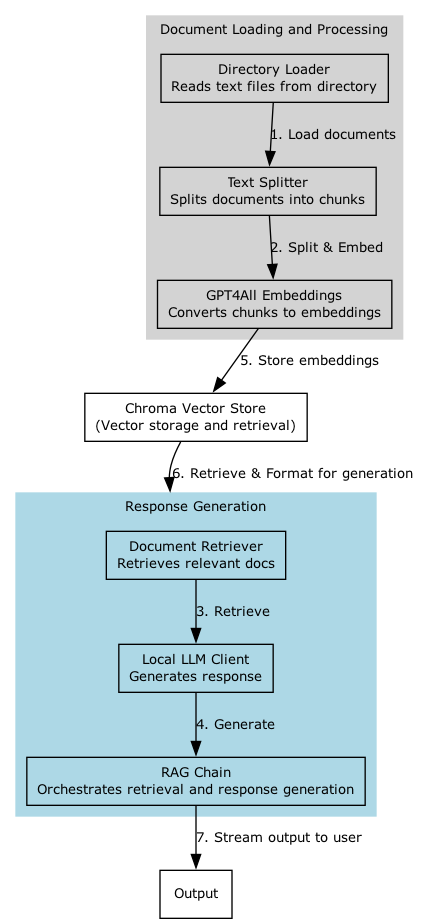

# Retrieval-Augmented Generation (RAG) Setup

## About
This repo came about at the back of my recent all-things GenerativeAI hands-on explorations followed by the cross-training into Machine Learning for a deeper understanding on this subject matter.
I have "preached" the [need for rapid upskilling](https://www.linkedin.com/pulse/need-frequent-upskill-age-genai-jaroslav-pantsjoha/?trackingId=ifjzoG1VQTi0CHVHRIwKGg%3D%3D) and indeed documented my own [#PersonalDevelopment journey here](https://jaroslav-pantsjoha.medium.com/google-cloud-machine-learning-exam-prep-broken-down-by-learning-effort-levels-21f96088a274). 
This repo will eventually grow a collection of my hands-on accelerators. 

Tag along and follow this journey on [Linkedin](https://www.linkedin.com/in/johas/) and [Medium Blog](https://jaroslav-pantsjoha.medium.com/)  

## Description
This project implements a Retrieval-Augmented Generation (RAG) system that leverages the power of local Large Language Models (LLMs) to enhance the process of generating responses based on the retrieval of relevant documents. The system reads multiple text files from a specified directory, processes these files to retrieve contextually relevant information, and uses this information to generate enhanced responses to user queries.

## Features
- **Multiple File Reading:** Automatically reads all text files within a specified directory, allowing for scalable content processing.
- **Advanced Text Processing:** Uses the `RecursiveCharacterTextSplitter` to split documents into manageable chunks for better embedding and retrieval.
- **Local LLM Support:** Configured to interact with a local LLM endpoint, reducing latency and reliance on external APIs.
- **Dynamic Content Retrieval:** Integrates Chroma vector storage for efficient storage and retrieval of document embeddings.
- **Interactive Query System:** Provides a live interface for users to enter queries and receive responses based on the retrieved documents.

## Architecture Details
The architecture consists of several key components:
- **Directory Loader:** Loads all text files from a given directory.
- **Text Splitter:** Splits large documents into smaller chunks for processing.
- **GPT4All Embeddings:** Converts text chunks into embeddings using GPT4All.
- **Chroma Vector Store:** Stores and retrieves embeddings efficiently.
- **OpenAI LLM Client:** Interfaces with a local LLM endpoint to generate responses based on retrieved text.
- **RAG Chain:** Orchestrates the flow from retrieval to response generation.

## Architecture
The system architecture is outlined in the diagram below. It showcases the flow from document loading and processing to response generation, facilitated by the interplay between various components.

### Getting Started
1. Clone the repository to your local machine.
2. Ensure you have a local LLM endpoint running at `http://localhost:1234/v1`.
3. Install the required Python libraries listed in `requirements.txt`.
4. Run the main script to start the RAG process: `python rag_process.py`.
5. Enter prompts as required to retrieve and generate responses.

### Dependencies
- Python 3.8+
- gpt4all
- langchain_openai
- bs4
- pathlib

### License
This project is licensed under the MIT License - see the LICENSE file for details.

## Contributing
Contributors are welcome to propose enhancements, fix bugs, or improve documentation. Please feel free to fork the repository and submit pull requests.
